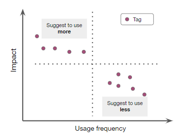

# Technical Assessment: `Data Analyst`
# Overview

At Memorable, we work predicting the cognitive impact of images and videos to optimize advertising strategies. Everyday, we work alongside our clients sharing new insights on what works and what does not based on their creative decisions and those of their competitors. In this technical assessment, you will be required to perform an insights extraction task that resembles the everyday work at Memorable's Creative Analytics team.

## Data
We have received data from a client describing the performance of their ads in social media platforms, along with the images and videos they have used for them. Ad performance is usually computed in terms of standardized metrics that reflect how the audience has interacted with the ad. For this report, the performance metrics of interest are:

- **CPC**: Cost per click, the quotient between the allocated budget for an ad and the amount of clicks it has received. The higher the CPC is, the worse the ad performed.
- **CTR**: Click-through rate, the percentage of people that have clicked on the ad after being presented with it. The higher the CTR is, the better the ad performed.
- **VVR**: Video view rate, the percentage of people that have watched the video featured in the ad entirely. The higher the VVR is, the better the ad performed.

Additionally, we have also ran a tagging system based on computer vision models to identify various creative elements featured in the files, including objects, displayed text, people demographics and others. We call these identified elements *tags* and they are grouped according to the type of element they relate to:

- **TEXT**: Text elements that are identified with OCR models directly from the displayed content 
- **LABEL** : Abstract concepts detected in the displayed content. These can range from scene characteristics (i.e. `outdoors`, `business`, `horizontal` framing) to topics (i.e. `health`, `people`).
- **FACE**: Output from people detection models. These tags include the person's ethnicity, age and gender.
- **CELEBRITY**: Identified famous personalities that appear in the asset.
- **BRIGHTNESS, CONTRAST, COLORFULNESS**: These tags relate to the different design choices made for the content's display and are presented as discretized labels like *high brightness levels*, *low colorfulness* or *medium contrast*.

Please note that all of these detections are outputs from AI models which are subject to varying levels of confidence. For reference, **we consider confidence values above 90% to be safe enough to work with**.

All this data has been consolidated in a single database, included in this repo, called `techtest.db`. In the `Data Dictionary` section below you will find a detailed description of its tables and the attributes it includes. Along the metadata stored in the database, you will also be provided with a [Google Drive folder](https://drive.google.com/drive/folders/157o7KIbV9kRSzHj1Gz-P5VM_EOP0WTDv?usp=share_link) where we have stored all the corresponding assets.

## Insights Extraction

We want to answer the following question with actionable insights that help our clients make better creative decisions while ideating their incoming campaigns. For this, we have outlined the following questions:

- **Which are the creative elements that drive higher ad performance?**
To address this question we seek to show a quantitative analysis on the correlation between tags featured in ads and the ad's performance. Ultimately, we are interested in seeing which are the tags that best predict ad performance. This can be done by leveraging various concepts from statistical analysis, including regression models (linear, tree based, etc.), predictive performance and correlation metrics and any other analytical methodology you find suitable.

- **Which creative elements should be included more in the client's ads and which should be used less?**
Having identified which tags impact more in an ad's performance, we seek to compare those results with the usage frequency of said tags. Frequency can be defined as the percentage of ads that feature a specific tag from the total amount of ads under analysis. For reference, you can see here a conceptual plot that can help you while extracting insights for this item.

# Delivery

Please fork this repository to prevent overwriting the task’s description.

**You will have 24 hrs since you receive this test to complete it**. Once the task is completed, please push to a Github repository and make sure to add the following users as collaborators:

- [JHevia23](https://github.com/JHevia23)
- [ppfreitas](https://github.com/ppfreitas)

Finally, notify by email to your recruitment contact. As part of the deliverable, you are expected to share:

- Jupyter Notebooks with your plots and analysis, along with any set of Python scripts you used for assistance.
- Answers to the outlined questions in the `Insights Extraction` section. This can be in a format you find best to communicate your findings (a Markdown file, Google Slides, inline comments in the Notebooks, or any other).

In case you have any questions, email [juan.hevia@memorable.io](juan.hevia@memorable.io).

## Data Dictionary
Description of main tables and attributes for the `techtest.db`.

**Table:** tag
**Description:** Output from our tagging system, including all creative elements 
**Attributes:**
- *Ad_id*: ID for the advertisement piece
- *Asset_id*: ID for the asset featured in the ad. Please note that different ads can feature the same asset.
- *Tag_name*: Value for the detected creative element
- *Tag_type*: Type of creative element detected
- *Confidence*: Confidence level for the detection. Each tag is the output of an AI model and as such is the product of an inference operation, that has an associated level of precision.
- *Start_timestamp*: Initial timestamp for the tag's detection. This attribute works for videos and is associated to the starting time at which the tag is detected.
- *End_timestamp*: Final timestamp for the tag's detection. This attribute works for videos and is associated to the ending time at which the tag is detected.
- *Start_frame*: Initial frame at which the tag was detected.
- *End_frame*: End frame at which the tag was detected.

**Table:** ad_performance
**Description:** Links one asset with one asset type
**Attributes:**
- *Ad_id*: ID for the advertisement piece 
- *Asset_id*: ID for the asset featured in the ad. Please note that different ads can feature the same asset.
- *Market*: Country to which the ad has been served
- *Asset_type*: File type
- *Date_captured*: Published date for the ad
- *CPC*: Cost per click, the quotient between the allocated budget for an ad and the amount of clicks it has received. The higher the CPC is, the worse the ad performed.
- *CTR*: Click-through rate, the percentage of people that have clicked on the ad after being presented with it. The higher the CTR is, the better the ad performed.
- *VVR*: Video view rate, the percentage of people that have watched the video featured in the ad entirely. The higher the VVR is, the better the ad performed.
